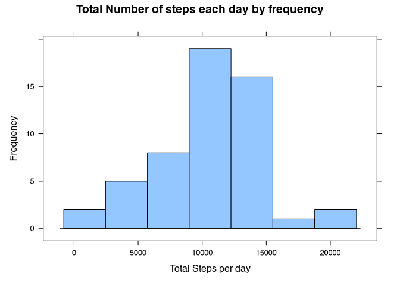
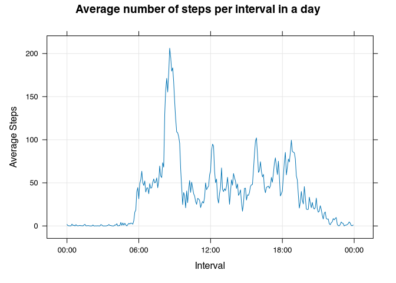
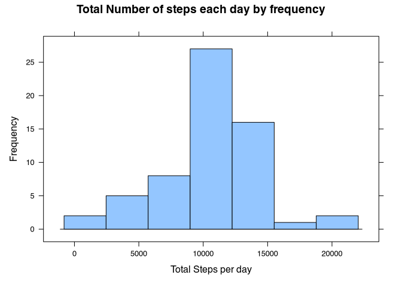
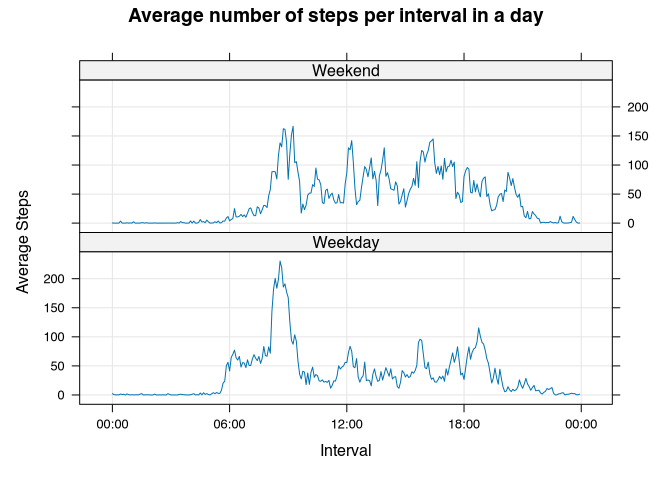

# Loading the libraries


```r
library(lattice)
library(lubridate)
```

```
## 
## Attaching package: 'lubridate'
```

```
## The following objects are masked from 'package:base':
## 
##     date, intersect, setdiff, union
```

# Downloading the dataset

Let's download the dataset using `download.file`.


```r
filename='activity.zip'
content='activity.csv'

if (!file.exists(filename) & !file.exists(content))
{
	print("Downloading the dataset...")
	download.file('https://d396qusza40orc.cloudfront.net/repdata%2Fdata%2Factivity.zip', filename, method='curl')
}
```

Now, let's unzip the archive using the `unzip` function.


```r
if (file.exists(filename) & !file.exists(content))
{
	print("Extracting the archive...")
	unzip(filename)
}
```

# Loading the data

Now, let's load the data using the `read.csv` function.
After loading, we'll have a first look at the data using `head`.


```r
df1 <- read.csv(content)
head(df1)
```

```
##   steps       date interval
## 1    NA 2012-10-01        0
## 2    NA 2012-10-01        5
## 3    NA 2012-10-01       10
## 4    NA 2012-10-01       15
## 5    NA 2012-10-01       20
## 6    NA 2012-10-01       25
```

# Dealing with the missing values

Now let's remove the rows with missing values.


```r
df2 <- df1[!is.na(df1$steps),]
head(df2)
```

```
##     steps       date interval
## 289     0 2012-10-02        0
## 290     0 2012-10-02        5
## 291     0 2012-10-02       10
## 292     0 2012-10-02       15
## 293     0 2012-10-02       20
## 294     0 2012-10-02       25
```

# Calculating the mean steps per day

## Total steps per day

Let's use the `aggregate` function for calculating the total number of steps per day.


```r
df3 <- aggregate(list(Total_Steps=df2$steps), by=list(Date=df2$date), FUN=sum)

df3$Date <- as.Date(strptime(df3$Date, "%Y-%m-%d"))

nrow(df3)
```

```
## [1] 53
```

```r
head(df3)
```

```
##         Date Total_Steps
## 1 2012-10-02         126
## 2 2012-10-03       11352
## 3 2012-10-04       12116
## 4 2012-10-05       13294
## 5 2012-10-06       15420
## 6 2012-10-07       11015
```

## Drawing a histogram for total steps


```r
plot1 <- histogram(~ Total_Steps, data=df3, type='count', xlab='Total Steps per day',
	ylab='Frequency', main='Total Number of steps each day by frequency',
	scales = list(x = list(format = "%Y-%m-%d")),
)

print(plot1)
```

<!-- -->

## Calculating the mean and median steps per day

### Mean


```r
mean(df3$Total_Steps)
```

```
## [1] 10766.19
```

### Median


```r
median(df3$Total_Steps)
```

```
## [1] 10765
```

# Average Daily activity pattern

Let's group the dataframe by intervals and steps, then we'll convert the interval to POSIXct time.


```r
# group steps and intervals
df4 <- aggregate(list(Mean_Steps=df2$steps), by=list(Interval=df2$interval), FUN=mean)

head(df4)
```

```
##   Interval Mean_Steps
## 1        0  1.7169811
## 2        5  0.3396226
## 3       10  0.1320755
## 4       15  0.1509434
## 5       20  0.0754717
## 6       25  2.0943396
```

```r
df4$Interval <- sapply(df4$Interval, formatC, digits=3, flag='0')
df4$Interval <- as.POSIXct(strptime(df4$Interval, format = "%H%M"))
```

## Drawing the plot

Now, let's draw the plot (lattice).


```r
plot2 <- xyplot(Mean_Steps ~ Interval, data=df4,
	ylab='Average Steps', main='Average number of steps per interval in a day',
	type=c('l', 'g'),
	scales = list(x = list(format = "%H:%M")),
)

print(plot2)
```

<!-- -->

## Interval with highest average steps


```r
t_str <- df4[which.max(df4$Mean_Steps),]$Interval # Interval with highest number of steps
t_str <- paste(format(t_str, "%H"), format(t_str, "%M"),sep=':') # Convert interval into human readable time
t_str
```

```
## [1] "08:35"
```

# Imputing missing values

# Total number of missing values

Now, we'll find out the total number of rows with missing values.


```r
nrow(df1[(is.na(df1$interval) | is.na(df1$date) | is.na(df1$steps)),])
```

```
## [1] 2304
```

```r
nrow(df1[(is.na(df1$steps)),])
```

```
## [1] 2304
```
So, we can conclude that missing values are only in the steps column.

## Filling the missing rows

We'll fill the missing values with the mean for that interval.


```r
df5 <- df1

# Converting the interval to POSIXct format
df5$interval <- sapply(df5$interval, formatC, digits=3, flag='0')
df5$interval <- as.POSIXct(strptime(df5$interval, format = "%H%M"))

tail(df5$steps)
```

```
## [1] NA NA NA NA NA NA
```

```r
missing <- is.na(df5$steps)
missing_intervals <- df5[is.na(df5$steps),]$interval
df5$steps[missing] <- sapply(missing_intervals, function(ps_value) {
	df4[(df4$Interval == ps_value),]$Mean_Steps
}) # Fill missing values

df5$interval <- sapply(df5$interval, function(ps_value){
	paste(format(ps_value, "%H"), format(ps_value, "%M"),sep=':') # Convert interval into human readable time
})

head(df1)
```

```
##   steps       date interval
## 1    NA 2012-10-01        0
## 2    NA 2012-10-01        5
## 3    NA 2012-10-01       10
## 4    NA 2012-10-01       15
## 5    NA 2012-10-01       20
## 6    NA 2012-10-01       25
```

```r
head(df5)
```

```
##       steps       date interval
## 1 1.7169811 2012-10-01    00:00
## 2 0.3396226 2012-10-01    00:05
## 3 0.1320755 2012-10-01    00:10
## 4 0.1509434 2012-10-01    00:15
## 5 0.0754717 2012-10-01    00:20
## 6 2.0943396 2012-10-01    00:25
```

## Creating a new dataset with filled data


```r
write.csv(df5, 'activity_new.csv')
```

## Histogram of total number of steps

Now, let's draw the histogram we drew earlier with the new dataframe `df5`.
For that we need to create a new dataframe for grouping intervals and steps similar to `df3`.


```r
df6 <- aggregate(list(Total_Steps=df5$steps), by=list(Date=df5$date), FUN=sum)

df6$Date <- as.Date(strptime(df6$Date, "%Y-%m-%d"))

head(df6)
```

```
##         Date Total_Steps
## 1 2012-10-01    10766.19
## 2 2012-10-02      126.00
## 3 2012-10-03    11352.00
## 4 2012-10-04    12116.00
## 5 2012-10-05    13294.00
## 6 2012-10-06    15420.00
```

Now, the histogram.


```r
plot4 <- histogram(~ Total_Steps, data=df6, type='count', xlab='Total Steps per day',
	ylab='Frequency', main='Total Number of steps each day by frequency',
	scales = list(x = list(format = "%Y-%m-%d")),
)

print(plot4)
```

<!-- -->

## Mean and median steps


```r
mean(df6$Total_Steps)
```

```
## [1] 10766.19
```

```r
median(df6$Total_Steps)
```

```
## [1] 10766.19
```

They actually differe from the first part of the assignment as the median is a non-integer number of steps.

# Are there differences in activity patterns between weekdays and weekends?

Let's create a new column in the non-missing dataframe called `daytype`. This column will be a boolean indicating whether the date is a weekend or not.


```r
df5$daytype <- sapply(df5$date, function(date_str){
	wd <- weekdays(as.Date(strptime(date_str, format='%Y-%m-%d')))
	if (wd == 'Saturday' | wd == 'Sunday')
		return("Weekend")
	"Weekday"
})
```
Grouping the dataframe by interval and daytype using the function `aggregate`.


```r
df7 <- aggregate(list(Mean_Steps=df5$steps), by=list(Interval=df5$interval, Day_Type=df5$daytype), FUN=mean)
head(df7)
```

```
##   Interval Day_Type Mean_Steps
## 1    00:00  Weekday 2.25115304
## 2    00:05  Weekday 0.44528302
## 3    00:10  Weekday 0.17316562
## 4    00:15  Weekday 0.19790356
## 5    00:20  Weekday 0.09895178
## 6    00:25  Weekday 1.59035639
```

```r
df7$Interval <- as.POSIXct(strptime(df7$Interval, format = "%H:%M"))
```

Now the panel plot.


```r
plot5 <- xyplot(Mean_Steps ~ Interval | Day_Type, data=df7,
	ylab='Average Steps', main='Average number of steps per interval in a day',
	type=c('l', 'g'),
	scales = list(x = list(format = "%H:%M")),
	layout = c(1, 2)
)

print(plot5)
```

<!-- -->
